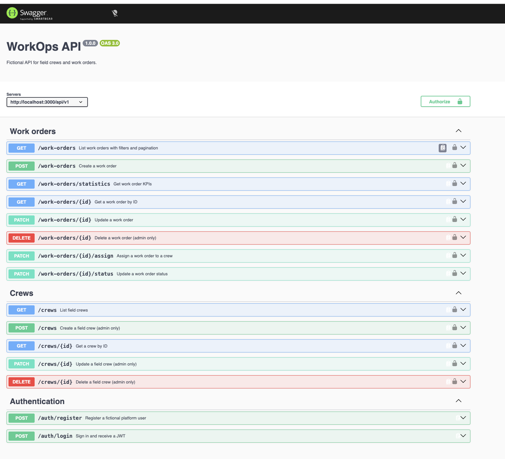

# WorkOps API

A fictional REST API for coordinating field crews and operational work orders. It is built as a portfolio project to demonstrate production-minded backend practices; all identities, addresses, and operational records are invented.

## Why I built this project

I built WorkOps API as a demonstration of backend architecture for operations and work-order management. It shows how a maintainable TypeScript service can model role-aware workflows, assignment, status transitions, reporting, validation, and secure API boundaries.

## Technology

- Node.js, TypeScript, Express 5
- PostgreSQL and Prisma ORM
- JWT, bcrypt, Zod, Helmet, CORS, rate limiting
- OpenAPI/Swagger UI, Vitest, ESLint, Prettier
- Docker and Docker Compose

## Architecture

`Route → Controller → Service → Repository → PostgreSQL`

Controllers only translate HTTP. Services own business rules and authorization-aware workflows. Repositories isolate Prisma persistence. Zod validates untrusted input at the boundary, and centralized middleware produces consistent errors.

```text
src/
├── config/          environment, Prisma, Swagger
├── controllers/     HTTP request handlers
├── middlewares/     authentication and errors
├── repositories/    database access
├── routes/          endpoint definitions
├── schemas/         Zod contracts
├── services/        business rules
├── types/           Express type augmentation
└── utils/           shared helpers
```

## Features

- Registration and JWT login with bcrypt password hashing
- Roles: `ADMIN`, `SUPERVISOR`, and `TECHNICIAN`
- Full CRUD for crews and work orders
- Crew assignment and controlled order status changes
- Work-order filtering by status, priority, crew, and creation date
- Pagination and operational statistics
- Swagger UI at `/api-docs`
- Centralized error handling, validated environment, Helmet, CORS, and rate limiting

## Quick start with Docker

Prerequisites: Docker Desktop with Docker Compose.

```bash
docker compose up --build
```

The API will be available at `http://localhost:3000`, health check at `/health`, and interactive documentation at `http://localhost:3000/api-docs`.
PostgreSQL is exposed on host port `5433` to avoid conflicting with a local PostgreSQL service.

For a seeded demo database, run this in a second terminal after the containers are healthy:

```bash
docker compose exec api npx prisma db seed
```

## Local installation

Prerequisites: Node.js 20+ and a running PostgreSQL 16+ instance.

```bash
cp .env.example .env
npm install
npx prisma generate
npx prisma migrate dev
npm run prisma:seed
npm run dev
```

Never commit `.env`. Generate a long random value for `JWT_SECRET` outside of local demos.

## Environment variables

| Variable         | Purpose                                |
| ---------------- | -------------------------------------- |
| `DATABASE_URL`   | PostgreSQL Prisma connection URL       |
| `JWT_SECRET`     | 32+ character signing secret           |
| `JWT_EXPIRES_IN` | Token lifetime, e.g. `1d`              |
| `PORT`           | HTTP port (default `3000`)             |
| `CORS_ORIGIN`    | Allowed browser origin                 |
| `NODE_ENV`       | `development`, `test`, or `production` |

## Commands

```bash
npm run dev             # run with reload
npm run build           # compile TypeScript
npm start               # run compiled API
npm test                # run Vitest suite
npm run lint            # lint source
npm run format:check    # verify formatting
npm run prisma:seed     # load fictional demo data
```

## API documentation

Interactive OpenAPI documentation is available at `/api-docs`.



## Main endpoints

| Method           | Endpoint                         | Access                  | Purpose                      |
| ---------------- | -------------------------------- | ----------------------- | ---------------------------- |
| POST             | `/api/v1/auth/register`          | Public                  | Register a user              |
| POST             | `/api/v1/auth/login`             | Public                  | Receive JWT                  |
| GET/POST         | `/api/v1/crews`                  | Auth / Admin            | List or create crews         |
| GET/PATCH/DELETE | `/api/v1/crews/:id`              | Auth / Admin            | Read, update, delete a crew  |
| GET/POST         | `/api/v1/work-orders`            | Auth / Admin-Supervisor | Filter/list or create orders |
| PATCH            | `/api/v1/work-orders/:id/assign` | Admin-Supervisor        | Assign a crew                |
| PATCH            | `/api/v1/work-orders/:id/status` | Any role                | Update status                |
| GET              | `/api/v1/work-orders/statistics` | Auth                    | Work-order KPIs              |

### Example

```bash
curl -X POST http://localhost:3000/api/v1/auth/login \
  -H 'Content-Type: application/json' \
  -d '{"email":"admin@workops.demo","password":"DemoPass123!"}'
```

Use the returned token as `Authorization: Bearer <token>`. Swagger UI provides an interactive version of these examples.

## Seed data

`prisma/seed.ts` creates 3 users, 5 crews, and 30 work orders. Demo password: `DemoPass123!`. The data is strictly fictional and intended only for local portfolio demonstrations.

## Technical decisions

- **Prisma migrations** make schema evolution reproducible.
- **Zod** keeps request contracts explicit before services run.
- **Role middleware** makes permissions visible at the route layer; services enforce assignment workflow invariants.
- **Pagination metadata** keeps list endpoints ready for UI consumers.
- **Decimal coordinates** avoid floating-point precision surprises in PostgreSQL.
